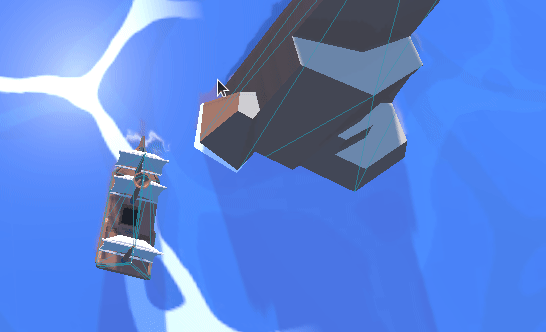

# The-Line-Prototype

`Shared` : All files that are used multiple times throughout the game.
`Shared/Scripts` All shared scripts including AI behaviors and math utlity classes.

> **The Line of Battle** is now being developed in Unreal Engine 4 in anticipation for Unreal Engine 5. You are free to use this abandoned project for whatever you want but you may not use the name "The Line" or "The Line of Battle" with these. Geometry assets are by [Kenny](https://www.kenney.nl/assets/pirate-kit) and the Water shader can be found [here](https://github.com/Chrisknyfe/godot-scraps/tree/master/water_shader) both of which are also completely free to use. 
